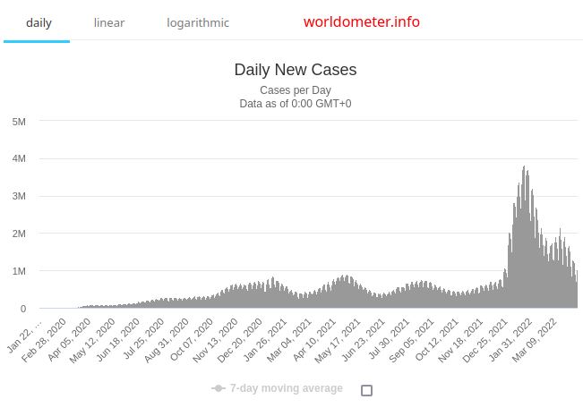

# Pertemuan 7 Basis Data - Pendekatan Basis Data Relasional dalam Penyelesaian Kasus Data Historical dan Kompleks

## Lesson Learning Outcome
Mahasiswa mampu mengidentifikasi berbagai kebutuhan Basis Data Relasional dalam kasus data historis dan data kompleks

## Pemodelan Data Historis

### Mengapa beberapa jenis data disimpan secara historis ?
- Analisis pengambilan kebijakan & mengambil hikmah

#### Contoh
- Indikator pembangunan dalam sebuah wilayah
  - Populasi penduduk Jawa Barat tahun 2010, 2011, 2012, 2013, dst.
  - Tingkat kemiskinan penduduk Kota Surabaya tahun 2015, 2016, 2017, dst. 
- Kepadatan lalu lintas ruas-ruas jalan di Kota Bandung per menit
- Monitoring kondisi fisik & mental per jam / per hari / per menit
- Jumlah kasus Covid 19 harian di Dunia

  
- Jumlah subscriber dan video dilihat per minggu

  
- Trafik website harian di Google Analytics

  

### Yang perlu diperhatikan dalam pemodelan data historis
- Apakah setiap ada operasi pada data harus dicatat untuk audit ?
- Apakah nilai atribut dari entitas berubah seiring waktu ?
  - Contoh: atribut berat badan dari entitas penduduk
- Apakah butuh membuat laporan dari data arsip ?
- Berapa lama data historis butuh disimpan ?

### Perubahan ERD untuk entitas yang memiliki data historis

Contoh:

||Karyawan|
|---|---|
|PK|ID|
||Nama|
||Gaji Bulanan|
||Tanggal Mulai Gaji|

- Karena gaji bulanan dapat berubah seiring waktu, maka data historis gaji perlu disimpan
- Dengan bentuk entitas seperti di atas, data historis gaji tidak dapat diketahui
- Maka ditambahkan entitas untuk menyimpan data historis gaji

||Karyawan|
|---|---|
|PK|ID|
||Nama|

||Histori Gaji|
|---|---|
|PK|Tanggal Mulai Gaji|
|PK|ID Karyawan|
||Gaji Bulanan|

Dengan relasi 
|Karyawan|1:M|Histori Gaji|
|---|---|---|


### Tanggal sebagai atribut vs Hari sebagai entitas

- Dalam entitas penyimpan data historis, **Tanggal** cukup menjadi atribut jika tidak ada atribut lain yang bergantung kepada **Tanggal**
  - Contoh:  
  
  ||Jadwal Pertandingan|
  |---|---|
  |PK|ID|
  ||Home|
  ||Away|
  ||Tanggal|
  ||Stadion|
  
- Jika ada atribut yang bergantung terhadap **Tanggal** misal **Kelembaban** dan **Temperatur** maka atribut **Tanggal** perlu dimekarkan menjadi entitas baru **Hari**
  - Contoh: entitas **Pembelian Tiket** yang mewakili jumlah pembelian tiket di tempat wisata berdasarkan tanggal

    ||Pembelian Tiket|
    |---|---|
    |PK|ID|
    ||Kuantitas|
    ||Harga Tiket|
    ||Tanggal|
    ||Kelembaban|
    ||Temperatur|

    Pada contoh diatas, atribut **Kelembaban** dan **Temperatur** melanggar aturan normalisasi bentuk ke 3 karena bergantung kepada **Tanggal**. Sehingga atribut **Tanggal** dimekarkan menjadi entitas **Hari**
    
    ||Hari|
    |---|---|
    |PK|Tanggal|
    ||Kelembaban|
    ||Temperatur|

### Penanganan data historis untuk harga barang 

## Pengantar dan Contoh Penggunaan Basis Data Relasional

### Membuat Tabel
[Membuat Tabel](https://www.tutorialspoint.com/mariadb/mariadb_create_tables.htm)

### Select Data

## Materi Terkait
- [Changes & Historical Modeling](https://sqldatabasetutorials.com/sql-db-section/changes-historical-modeling/)
- [Relational Database](https://sqldatabasetutorials.com/sql-db/relational-database/)

## Quiz
- Berikan contoh pemanfaatan data historis
- Rancang ERD untuk penyimpanan data karyawan dari sebuah perusahaan, lengkap dengan data historis gaji, data historis tempat tinggal, dan data historis jabatan. Selanjutnya, implementasikan ERD tersebut pada basis data relasional (MySQL / PostgreSQL / SQL Server / dll) menggunakan perintah 

```sql
CREATE TABLE
```
- Simpan keseluruhan jawaban pada file quiz.md di folder repository pertemuan 7
